Log4j2customApplication
Bu Java proyekti Spring Boot və Log4j2 ilə hazırlanmışdır. Məqsədi müştərilərin sifarişlərinin idarə edilməsi və bu sifarişlərin qeydiyyatının saxlanılmasıdır.

Proyekt Haqqında
Proyektin əsas xüsusiyyətləri və texnalogiyaları:

Spring Boot: MVC arxitekturası üzrə Java proqramlaşdırma çərçivəsi.
Log4j2: Güclü loglama və izləmə üçün konfiqurasiya edilmişdir. Fayl konsol və MySQL verilənlər bazasına loglama tətbiq olunur.
MySQL: Verilənlər bazası üçün istifadə olunur proyektin həm loglarını saxlamaq üçün həm də müştəri sifarişlərini qeyd etmək üçün.
Loglama Strategiyası
Log4j2 konfiqurasiyası aşağıdakı strategiyaları təyin edir:

SizeBasedTriggeringPolicy: Faylın həcmi 10GB-dan çox olduqda faylın yenilənməsi siyasəti.
DefaultRolloverStrategy: Faylın maksimum 10 nüsxəyə çatdıqdan sonra yenilənməsi siyasəti.
JDBC Konfiqurasiyası
Verilənlər bazasına logların yazılması üçün JDBC konfiqurasiyası aşağıdakı parametrlərlə təyin olunmuşdur:

xml
<!-- JDBC Appender -->
<JDBC name="Database" tableName="logs">
    <ConnectionFactory class="org.apache.logging.log4j.core.appender.db.jdbc.DataSourceConnectionSource">
        <Property name="dataSourceClassName" value="com.mysql.cj.jdbc.MysqlDataSource"/>
        <Property name="dataSource.url" value="jdbc:mysql://localhost:3306/log4j"/>
        <Property name="dataSource.user" value="root"/>
        <Property name="dataSource.password" value="root"/>
    </ConnectionFactory>
    <Column name="event_date" pattern="%d{yyyy-MM-dd HH:mm:ss}" isEventTimestamp="true"/>
    <Column name="level" pattern="%level"/>
    <Column name="logger" pattern="%logger"/>
    <Column name="message" pattern="%message"/>
</JDBC>
Bu konfiqurasiyada logs cədvəlinə loglar əlavə edilir. Bunlar eyni anda hem MySQL verilənlər bazasında saxlanılır hem də fayl və konsolda göstərilir.

İstifadə olunan Texnologiyalar
Spring Boot
Log4j2
MySQL
Lombok

Bu şəkillər proyektin funksiyalarını və interfeysini daha aydın göstərmək üçün əlavə olunmuşdur.

1. **Şəkil 1:** 
   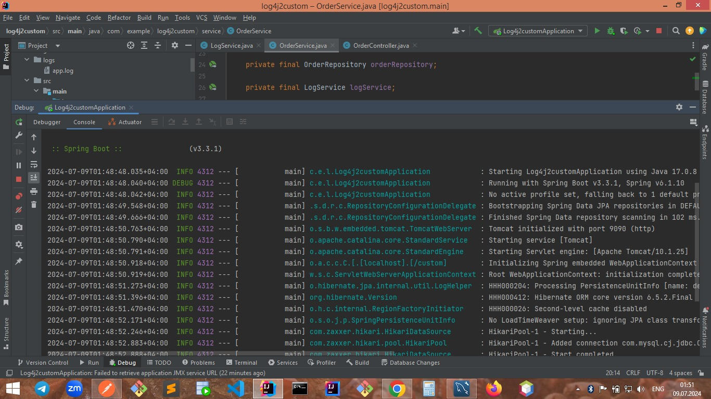

2. **Şəkil 2:**
   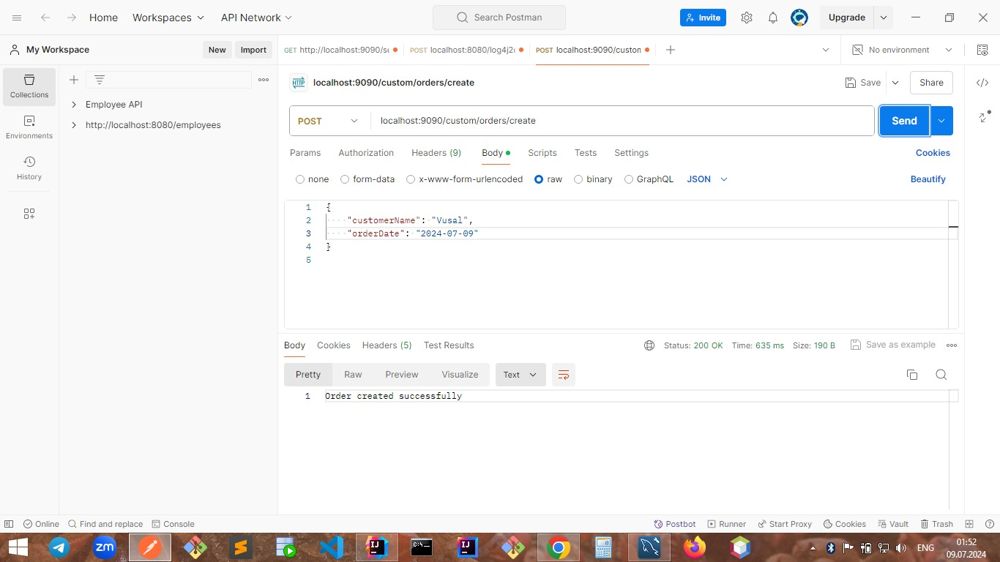

3. **Şəkil 3:**
   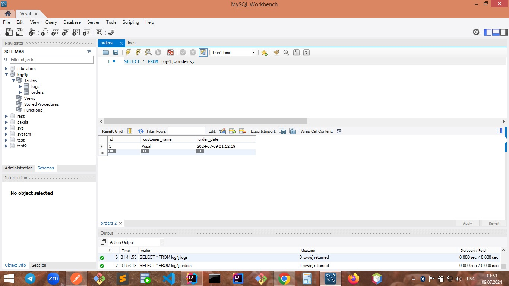

4. **Şəkil 4:** 
   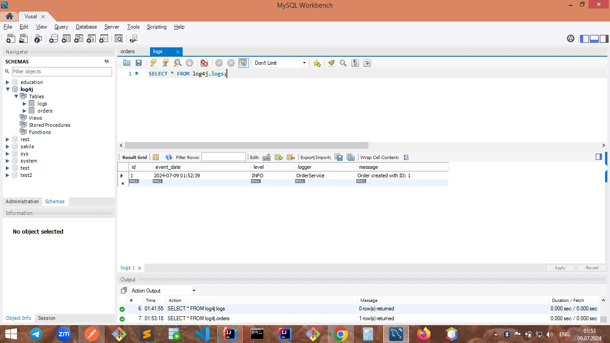

5. **Şəkil 5:**
   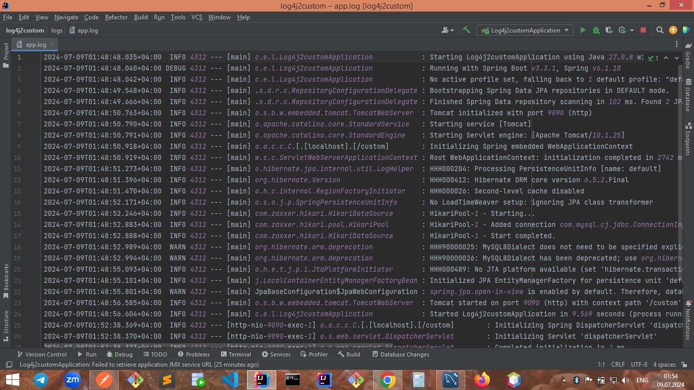

6. **Şəkil 6:** 
   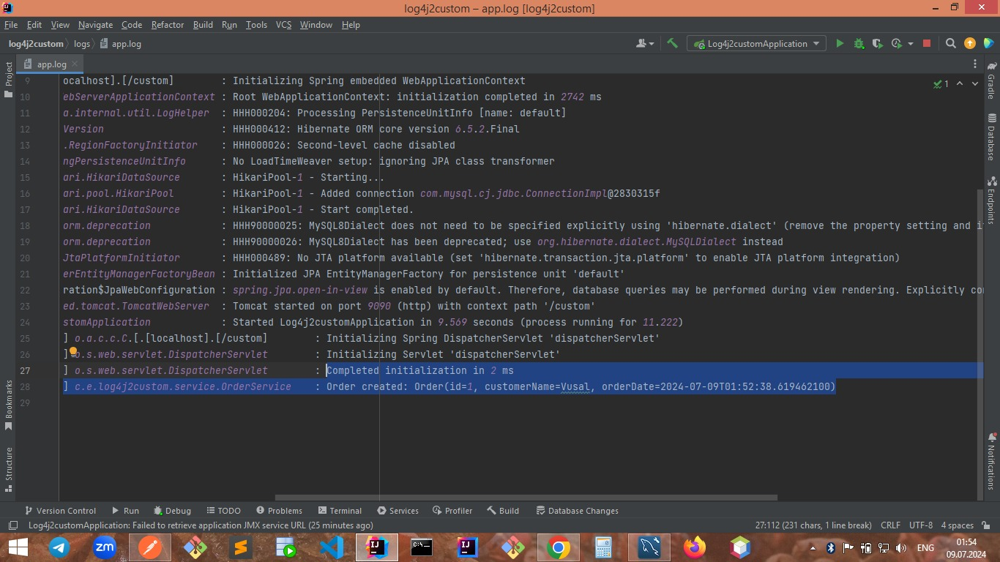

7. **Şəkil 7:** 
   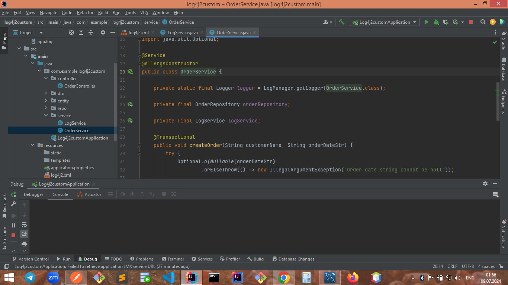

8. **Şəkil 8:**
   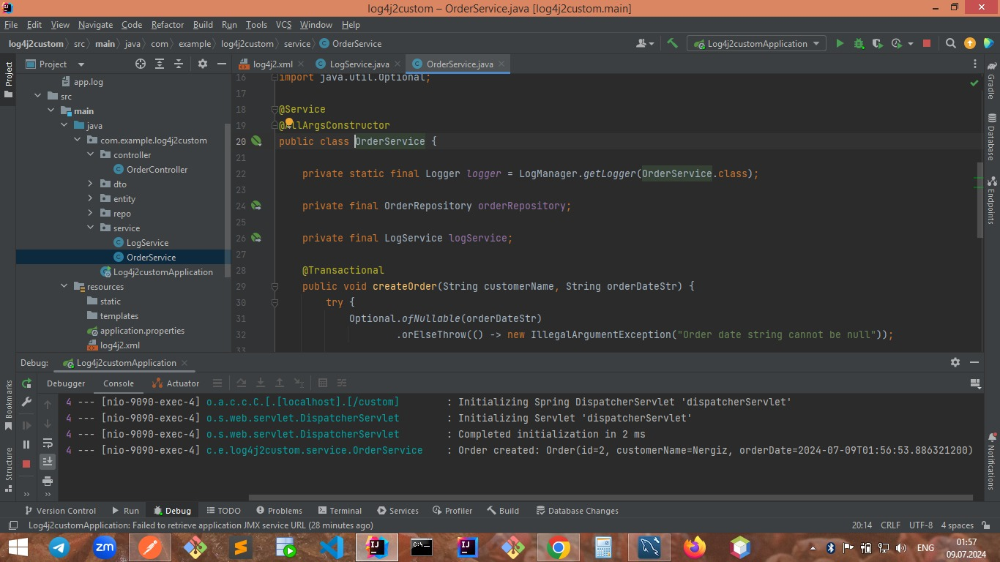

9. **Şəkil 9:** 
   

10. **Şəkil 10:** 
   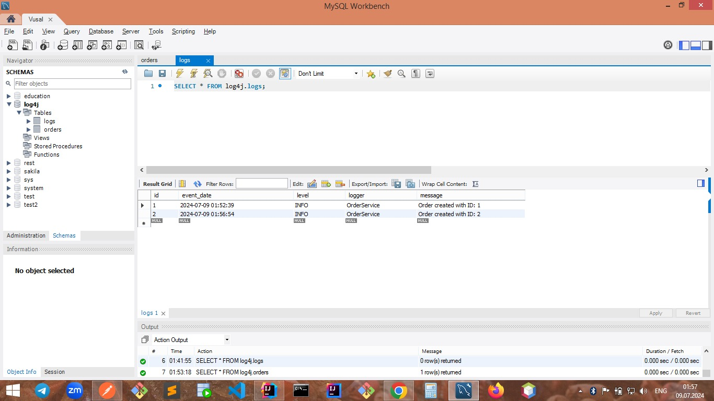

11. **Şəkil 11:**
   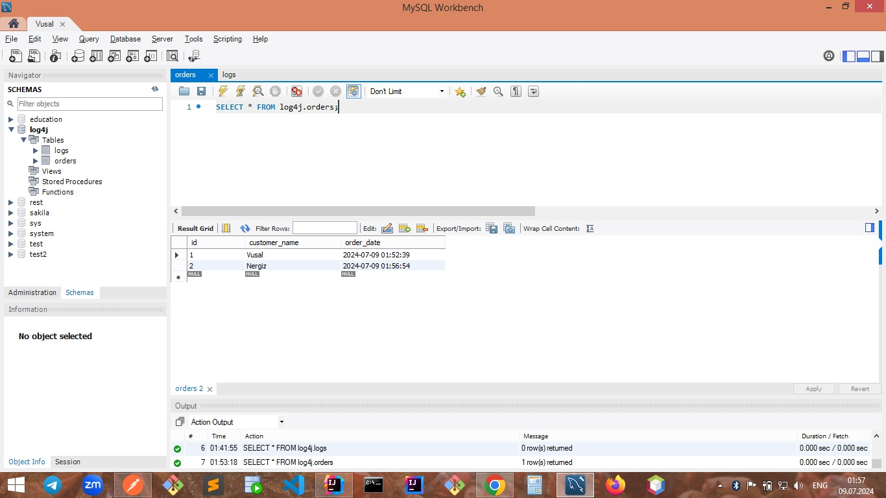

12. **Şəkil 12:** 
   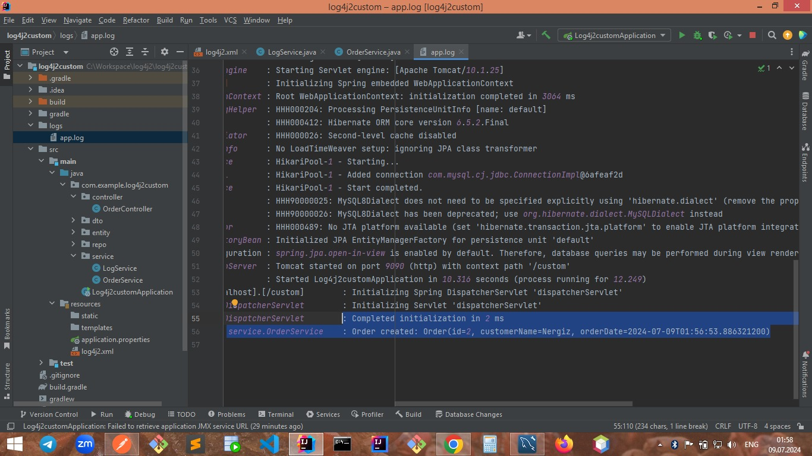

